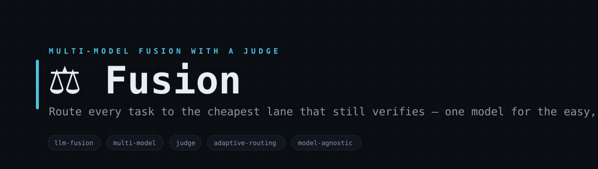
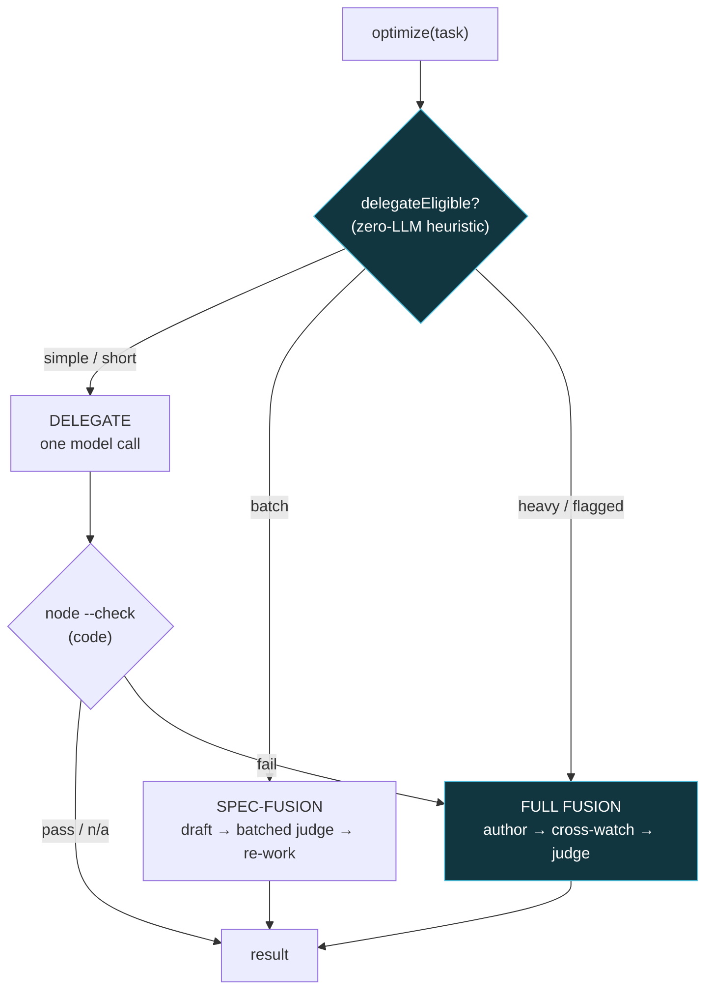

<!-- Fusion — white-label. No personal or company identifiers in this file by design. -->

<p align="center">
  
</p>

<h1 align="center">⚖️ Fusion</h1>

<p align="center">
  <b>Route every task to the cheapest lane that still verifies — one model for the easy, a panel plus a judge for the hard.</b><br>
  <sub>Fusion is a front door for LLM work that picks the cheapest lane that still gets the right answer. Trivial tasks go to a single model. Homogeneous batches run speculative batch-fusion — draft cheap, verify the whole block in one judge pass, re-work only what fails. Hard or high-stakes tasks get the full panel: an author drafts, a second model cross-watches and refines, and a judge does a final correctness-and-elevate pass. Deterministic checks (node --check for code) gate every lane so nothing ships unverified. Every model is a one-function adapter, so Fusion is model-agnostic and runs $0 out of the box with a built-in echo model.</sub>
</p>

<p align="center">

= 18">

</p>

<p align="center">
<code>llm-fusion</code> · <code>multi-model</code> · <code>judge</code> · <code>adaptive-routing</code> · <code>model-agnostic</code> · <code>zero-deps</code>
</p>

---

## Why Fusion

Sending every prompt through a big multi-model pipeline is wasteful; sending every prompt to one cheap model is risky. Fusion decides per task. A fast heuristic (no LLM call) classifies the work: simple kinds and short tactical asks take the DELEGATE lane — one model, seconds. Homogeneous batches take SPEC-FUSION — a cheap author drafts all of them, a deterministic check early-accepts the provable ones, and the rest are verified in a single batched judge pass. Anything heavy, precision, or explicitly flagged takes FULL FUSION — author, cross-watch refine, and a judge that must match a strong-expert floor and then elevate. Escalation is automatic and one-way: a failed check falls through to a stronger lane. Bring your own models through a tiny adapter, or use the built-in echo model to watch the whole thing run with no API key.

---

## What it does

| Module | What it does | Signal |
|---|---|---|
| **router** | optimize() picks a lane from a zero-LLM heuristic; escalation is automatic and one-way | cheapest-that-verifies |
| **delegate lane** | Simple kinds + short asks → ONE model call, node --check-gated for code | seconds, $0 |
| **spec-fusion lane** | Batches draft cheap, verify the block in one judge pass, re-work only failures | the amortization lever |
| **full-fusion lane** | author → cross-watch refine → judge (floor-then-elevate) for heavy/high-stakes | maximum scrutiny |

---

## Architecture



---

## Quickstart

```bash
# 1. no install needed — pure Node builtins; runs $0 with the built-in echo model
node lib/fusion.cjs "summarize the CAP theorem in two sentences"

# 2. force a lane / set a kind
node lib/fusion.cjs --kind=code --full "write a debounce function with a cancel method"

# 3. batch (spec-fusion lane) — one task per line
node lib/fusion.cjs --batch --task-file=tasks.txt --kind=code

# 4. see the router pick lanes across a mixed set
node examples/demo.cjs

# 5. plug in your own models (author / crossWatch / judge)
FUSION_MODELS=./examples/models-echo.cjs node lib/fusion.cjs --full "design a rate limiter"
```

> Out of the box Fusion uses a deterministic built-in echo model, so every lane runs with no API key — ideal for tests and CI. Point FUSION_MODELS at an adapter exporting { author, crossWatch, judge } to use real models. The spec-fusion draft cache persists to ./data (gitignored). Every lane is fail-open and never throws.

---

## Repository layout

```
fusion/
├── lib/
│   ├── fusion.cjs          ← the front door: optimize() router + delegateEligible + full-fusion lane
│   ├── spec-fusion.cjs     ← the batch lane: draft → batched judge → residual re-work → cache
│   ├── models.cjs          ← resolves your FUSION_MODELS adapter, or the built-in echo model
│   └── echo-model.cjs      ← the deterministic built-in { author, crossWatch, judge } (no API key)
├── examples/
│   ├── demo.cjs            ← run a mixed set, print the lane + verdict per task
│   └── models-echo.cjs     ← a copyable real-model adapter template
└── data/                   ← spec-fusion draft cache (gitignored, auto-created)
```

---

## Design principles

1. **Cheapest lane that still verifies.** Route by a zero-LLM heuristic; simple work never pays for the panel, heavy work never gets under-served.
2. **A judge, not a vote.** The full lane's judge must match a strong-expert floor and then elevate — never weaker than the best single draft.
3. **Deterministic gates keep it honest.** node --check gates every lane for code; a fail auto-escalates instead of shipping.
4. **Model-agnostic + fail-open.** Every model is a one-function adapter; a built-in echo model runs all lanes $0. Nothing throws.

---

<p align="center"><sub>Fusion · delegate · spec-fusion · full-fusion · MIT</sub></p>
