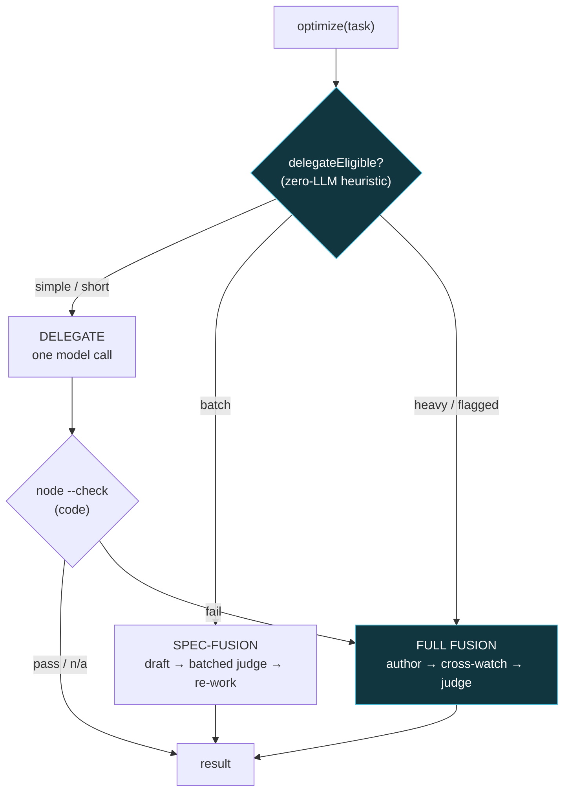

# Fusion — Architecture

Fusion is a front door for LLM work that picks the cheapest lane that still gets the right answer. Trivial tasks go to a single model. Homogeneous batches run speculative batch-fusion — draft cheap, verify the whole block in one judge pass, re-work only what fails. Hard or high-stakes tasks get the full panel: an author drafts, a second model cross-watches and refines, and a judge does a final correctness-and-elevate pass. Deterministic checks (node --check for code) gate every lane so nothing ships unverified. Every model is a one-function adapter, so Fusion is model-agnostic and runs $0 out of the box with a built-in echo model.

## Flow

## How it fits together

Fusion is a front-door router over three lanes with a shared, injectable model layer. `optimize(input, opts)` first calls `delegateEligible()` — a pure heuristic (no LLM call): explicit flags/precision/task-file force FULL FUSION; simple kinds (chat, copy, classify, summarize, reply, general) or short inputs take DELEGATE; code is delegate-eligible but node --check-gated. DELEGATE runs one author call; for code, a failed node --check auto-escalates to full fusion (one-way). The `--batch` path routes a list through SPEC-FUSION (`lib/spec-fusion.cjs`): draft each task with a cheap author in parallel, early-accept any code that passes node --check with no judge call, verify the rest in ONE batched judge pass, and residual-re-draft only items that still fail their check — accepted blocks cache by task signature under ./data. FULL FUSION drafts with the author, hands the draft to `crossWatch` (a second model that critiques and refines), then to `judge` for a floor-then-elevate final pass. All three roles resolve through `lib/models.cjs`, which loads a `FUSION_MODELS` adapter exporting `{ author, crossWatch, judge }` or falls back to a deterministic built-in echo model so every lane runs with no API key. Every stage is guarded and falls back to the best available draft, so `optimize()` never throws.

## Extending it

Every capability is a self-contained module. To add your own, follow the contract the existing
modules use and wire it into the entry point. Keep it portable — config via `.env`, no hardcoded
paths, no personal accounts.

## Design principles

1. **Cheapest lane that still verifies.** Route by a zero-LLM heuristic; simple work never pays for the panel, heavy work never gets under-served.
2. **A judge, not a vote.** The full lane's judge must match a strong-expert floor and then elevate — never weaker than the best single draft.
3. **Deterministic gates keep it honest.** node --check gates every lane for code; a fail auto-escalates instead of shipping.
4. **Model-agnostic + fail-open.** Every model is a one-function adapter; a built-in echo model runs all lanes $0. Nothing throws.
